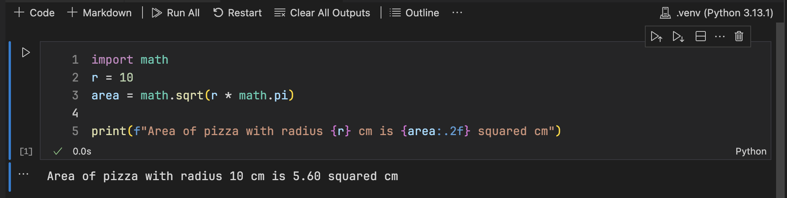

# Introduction to machine learning

**The materials are under development!**

Klick på <a href="README_dk.md">🇩🇰 Dansk</a> version.

This repository contains learning materials, which can be used for introducing anyone to very basics of data science and Python programming based on "learning by doing" principle. The materials are created for the middle and high school students in Denmark, but can be used by anyone else as well.

It is not a complete course but rather an appetizer to let students get a feeling of how modern machine learning methods work and what they can self do.

The materials are created by Sergey Kucheryavskiy and Akam Petersen from [Aalborg University](https://www.en.aau.dk) with support from Esbjerg Seminariums Uddannelsesfond. The materials are available in both English and Danish languages.

## Short description

The present learning materials can be used for introducing middle and high school students (or anyone else) to the very basics of data science. They are created in a way, which can be understood by anyone who:

1. Knows basics of math (at level corresponding to 8th year of public school in Denmark or above).
2. Knows a little about programming (just some very basic ideas).
3. Can install and run software on own computer.

Although all exercises are based on Python, no specific knowledge is required, all details will be given gradually during the course activities.

In principle, the materials can also be used for self-learning, however they are developed in a way to support a teacher rather than for self-learning. It is assumed that during the classes, a teacher will explain the most difficult parts using a black board and some additional illustrations, e.g. power point slides, etc.

The activities include four interactive classes. Each class is represented by a [Jupyter notebook](https://jupyter.org), which contains short explanation of the topics of interest, examples of Python code for learning, and place for exercises, where students will write own code in order to solve various problems. There are also several datasets which are necessary for some of the exercises.

The list and short description of the course activities (classes) is given below. Every class has a dedicated folder in this repository, inside this folder you will find all materials, including Jupyter notebook in Danish (`da.ipynb`) and English (`en.ipynb`), images and other datasets, as well as other materials, e.g. Excel spreadsheet, to support teaching.

### Class 1. Digital images

The first class demonstrates how images are represented on computers and other electronic devices, how to generate digital images, how to load and save them, and how to manipulate (transform) the images. It also utilizes images to introduce an idea of arrays and how to manipulate them (making subsets, transpose, stack, etc.) and the idea of convolution (in form of image filtration).


### Class 2. Tabulated data and classification

The second class has two parts. The first part introduces tabulated data, how to create, save, load and visualize such datasets. The second part tells how to make a simple classification model to arrange data measurements into groups — *classify* them. It tells what classification is in general and how to assess a quality of classification model. The model to be developed in the class is very trivial, based on finding manual thresholds values and does not involve a machine learning as such. A simple but famous dataset [Iris flower](https://en.wikipedia.org/wiki/Iris_flower_data_set) is used in this class.


### Class 3. Artificial Neural Networks

The third class continues the classification topic but this time it shows how to solve this problem using neural networks. It introduces the concept of ANN and shows how they work based on a very simple network consisting of a single neuron. Then it shows how to make more sophisticated networks, how to train them and assess their quality. At the end it teaches how to make multiclass classifier. Same Iris dataset is used in this class.

### Class 4. Using ANN for image classification

The final class combines all gained knowledge together and shows how to create more advanced networks, which include feature engineering (via convolutional and pooling layers). It explains how these layers work and how to use them for classification of images. It also provides more details about training and validation processes, introduce the idea of data loaders and batch training. During the class students will train a simple convolutional neural network which recognizes if a person on a photo wears glasses or not.

At the end, this class familiarizes students with the concept of fine tuning and transfer learning, and shows how the same task can be solved using one of the pre-trained networks available in Torch library.


## Guidelines for students

Anyone who can install and use programs on a computer and knows school math can take this course. It will be easier if you also know the very basic of programming (e.g. tried already either one of programming languages or visual programming systems, like [Scratch](https://scratch.mit.edu) or [Lego Mindstorms](https://www.lego.com/en-dk/themes/mindstorms/learntoprogram) or similar). But it is not expected that you have good skills in that.

It is also assumed that you will take guided classes organized by someone. Self learning is possible but will be a bit more difficult.

Here is what you need to do in order to prepare for the class:

### 1. Install Python on your computer

There are many different ways to do this, the simplest and most straightforward one is to open the Python website ([https://www.python.org/downloads/](https://www.python.org/downloads/)) in a browser and it will offer you downloading the latest version for your system (Windows or Mac). Just download the installer, run it, and follow the guides on the screen.

### 2. Install VS Code

VS Code is a free software for developing of computer programs on any language, including Python. Simply go to the VS Code website ([https://code.visualstudio.com](https://code.visualstudio.com)) and you will see a large Download button with the latest version suitable for your system. Download the installer, run it, and follow the guides.

### 3. Install Jupyter package

Now you need to install a special library for Python which will let you use Jupyter notebooks. Jupyter notebook is a simple document, which looks like Word with Python code chunks inside the text. So you can run the code inside the notebook. It makes using Python extremely easy.

To install the library just run VS Code that you installed on the previous step. Click on menu *Terminal* and select option *New Terminal*. You will see a small window appeared in the bottom of the VS Code window and inside this window you can write different commands. Write the following:

```
pip install jupyter
```

Pres Enter on keyboard and wait. If you do not see any error messages at the end it worked and you can proceed with the last step.


### 4. Install VS Code extensions

You also need to install several extensions which makes VS Code easier to use for this course. You will find a list of extensions with links below. Simply click on the link, it will open a web page with extension, which has a button *Install*. Click on the button and give permission to open it in VS Code (your system will ask you about this). After that, you will get VS Code open with the Extension information inside. Simply click *Install* button there and wait. Then repeat this for the other extensions from the list.

* [Python extension](https://marketplace.visualstudio.com/items?itemName=ms-python.python)
* [Jupyter notebook extension](https://marketplace.visualstudio.com/items?itemName=ms-toolsai.jupyter)

After that, close VS Code and then start it again. Click on *File* menu, select *New File* and then find Jupyter notebook as shown below (your list of file types will be different but Jupyter Notebook should be in the list).


Click on the *Jupyter Notebook* list item and in the new tab you will get an empty notebook with a cell where you can write Python code and run it inside the notebook. Write the following:

```python
import math
r = 10
area = math.sqrt(r * math.pi)

print(f"Area of pizze with radius {r} cm is {area:.2f} squared cm")
```

Then click on a run button on the left side of the cell (looks like a triangle). When you do it first time VS Code will ask you which kernel you want to use. Just select the first option from the provided list (it should be the Python version you have installed).

After that, VS Code will run the code and show you the result. This is how it will look like:



If it works, then you are almost ready for the course!

If you want to understand what the code does, Google about simple Python code instructions, for example try [this tutorial](https://www.geeksforgeeks.org/python-for-kids/) or [this ones](https://kidspython.com/).

Although it is not necessary you will learn everything in the classes.

### 5. Download the course materials

Finally you need to download an archive (zip-file) with course materials, here is the [direct link](https://github.com/svkucheryavski/mlcourse/releases/download/0.0.1/mlcourse.zip). Simply download the archive and unzip it to any folder which you can easily access, for example to Desktop or to Documents (or to any other dedicated folder).

This is it. **If you have troubles with any of the steps just ask course teacher for help.**


## Guides for teachers

First of all, please read the description and the user guides for students, install everything as it is written in the guide. Although installation of Python proposed to the students is not the best one (in this case perhaps the most optimal will be to install it from [Conda](https://docs.conda.io/en/latest/)), it is the most simple and straightforward way, good enough for beginners.

After that, start VS Code and open the folder with course materials in VS Code window. You will see the course structure on the left panel. Materials for every class is located in a separate folder. There are two notebooks inside each, `da.ipynb` is in Danish and `en.ipynb` is in English.

The folders also contain datasets needed to run the code in the notebooks as well as illustrations and additional materials (like Excel spreadsheets for the first and the last classes).

In addition to the four classes we also recommend to run an additional activity — working on a project in groups. The project can be anything which a) is fun for the target audience and b) requires some additional research.

For example it can be creating (or fine tuning) of CNN network to classify garbage. You can download corresponding datasets from Kaggle: [dataset 1](https://www.kaggle.com/datasets/asdasdasasdas/garbage-classification?select=Garbage+classification), [dataset 2](https://www.kaggle.com/datasets/farzadnekouei/trash-type-image-dataset). Try to [search](https://www.kaggle.com/datasets?search=image+classification) in Kaggle for more interesting datasets.

Let students work in groups and make a model which solves the problem. The final model can be then sent to you, so you can test it on separate test set. There can be even a competition with prizes depending on classification quality, model size, or speed of the recognition, etc.

There can be of course other forms of project activities more suitable for a particular group of students.
